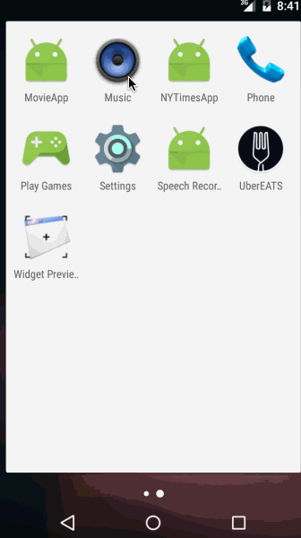

# Assignment 2: New York Times App
Uses NYT api to search and display articles, including filters and sorting by time
Time spent: 14 hours
# User Stories:

* [x] User can enter a search query that will display a grid of news articles using the thumbnail and headline from the New York Times Search API

* [x]User can click on "filter" icon which allows selection of advanced search options to filter articles

* [x]User can configure advanced search filters such as begin date, sort order, news desk values

* [x] Subsequent searches will have any filters applied to the search results.

* [x] User can tap on any article in results to view the contents in an embedded browser

* [x] User can scroll down "infinitely" to continue loading more news articles. The maximum number of articles is limited by the API search

optionals:

* [x] Use the ActionBar SearchView or custom layout as the query box instead of an EditText.

* [x] User can share a link to their friends or email it to themselves

* [x] Improve the user interface and experiment with image assets and/or styling and coloring

gif:

This was definitely a trickier assignment. The ActionBar works well for me, but sometimes seems unresponsive after articles have already been loaded and I'm not sure why. also had some difficulties applying the filters, the API documentation was very vague when describing how to incorporate them in code, rather than just a query. i used params and it seemed to work ok but I'm still a little foggy on the API itself.
